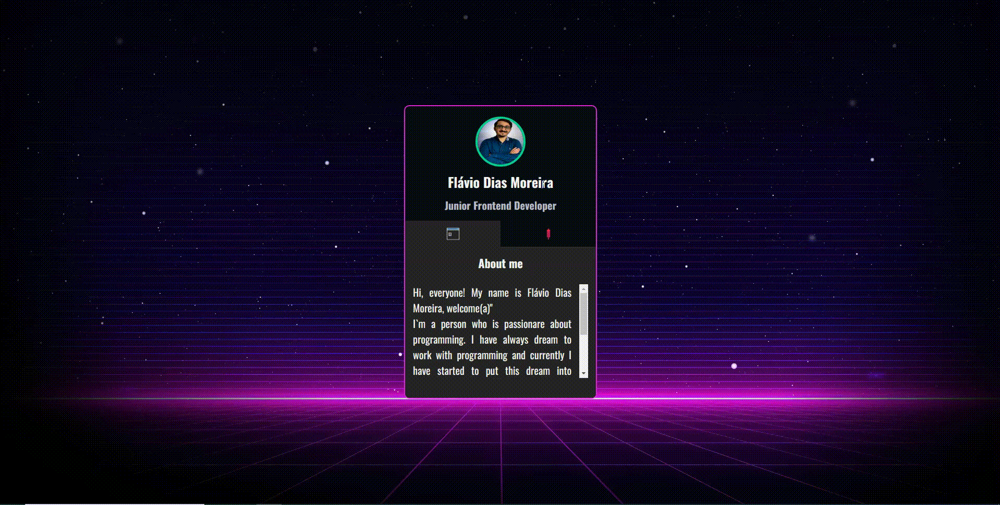

# Projeto - Mini Portfólio
Um projeto desenvolvido com o intuito de demonstrar minhas habilidades com a programação e também um pouco de minhas características. É um mini portfólio, em formato de card. Na primeira parte, conto um pouco quem eu sou e as tecnologias que tenho estudado. Na segunda parte é contida minhas informações pessoais e profissionais, como meu currículo, linkedIn e Github. 🚀❤🙌

[]

## Tecnologias utilizadas 🚀
- HTML5
- CSS3
- JAVASCRIPT
- PHOTOSHOP

## Por que desenvolvi o projeto?
Este trabalho foi desenvolvido com o objetivo de mostrar algumas informações pessoais, as tenologias que tenho estudado nesta modalidade de desenvolvimento frontend tanto quanto, acionando o outro ícone, mostra as minhas redes sociais. O design foi elaborado por mim com a utilização do photoshop. Espero que curtem e ajude compartilhando!!!

Feito com ❤ por Flávio Dias Moreira 👏 [Veja meu LinkedIn](https://www.linkedin.com/in/fl%C3%A1vio-dias-moreira-89102a218/)